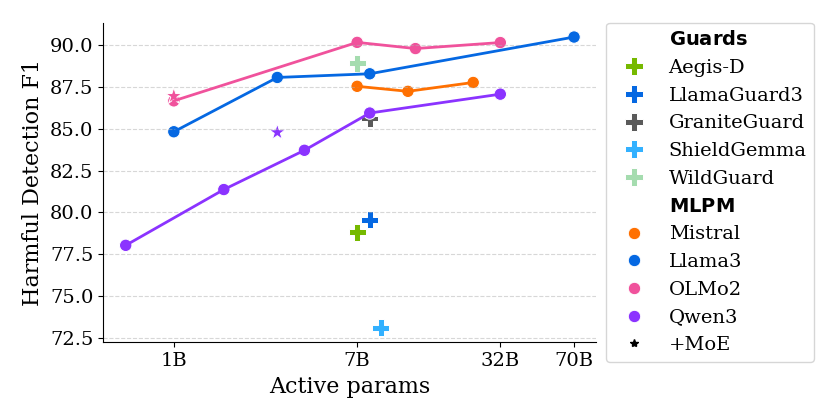

# Multi-layer Latent Prototype Moderator
This is the official repository for the paper "Efficient LLM Moderation with Multi-Layer Latent Prototypes"

<figure>
  
  <figcaption>Average moderation score across 8 diverse datasets. Multi-layer Latent Prototype Moderator~(MLPM), our distance-based safety assessment method, outperforms existing guard models on safety assessment while requiring no training and providing customizability.</figcaption>
</figure>


## Abstract
Although modern LLMs are aligned with human values during post-training, robust moderation remains essential to prevent harmful outputs at deployment time. Existing approaches suffer from performance-efficiency trade-offs and are difficult to customize to user-specific requirements. Motivated by this gap, we introduce Multi-Layer Prototype Moderator (MLPM), a lightweight and highly customizable input moderation tool. We propose leveraging prototypes of intermediate representations across multiple layers to improve moderation quality while maintaining high efficiency. By design, our method adds negligible overhead to the generation pipeline and can be seamlessly applied to any model. MLPM achieves state-of-the-art performance on diverse moderation benchmarks and demonstrates strong scalability across model families of various sizes. Moreover, we show that it integrates smoothly into end-to-end moderation pipelines and further improves response safety when combined with output moderation techniques. Overall, our work provides a practical and adaptable solution for safe, robust, and efficient LLM deployment.

## Table of Contents
- [Abstract](#abstract)
- [Table of Contents](#table-of-contents)
- [Reproducing Results](#reproducing-results)
  - [Pre-requisites](#pre-requisites)
    - [Environment](#environment)
  - [Data](#data)
  - [Evaluating baselines](#evaluating-baselines)
    - [Guard Models](#guard-models)
  - [Calculating latent representations](#calculating-latent-representations)
    - [Training data](#training-data)
    - [Evaluation data](#evaluation-data)
  - [Evaluating MLPM](#evaluating-mlpm)
    - [All eval datasets](#all-eval-datasets)
  - [Steering experiments](#steering-experiments)
  - [Plotting](#plotting)
  - [Citation](#citation)
## Reproducing Results
### Pre-requisites
#### Environment
To reproduce the results, you need to install the following packages:
```bash
pip install -r requirements.txt
```

### Data
To download the data, first run the following commands:
```bash
git clone git@github.com:allenai/safety-eval.git
python scripts/preprocessing/prepare_datasets.py
python scripts/preprocessing/prepare_training_datasets.py.py
python scripts/preprocessing/prepare_wildguard_mix_for_training.py
```


### Evaluating baselines
#### Guard Models
To evaluate the Guard models, run the following command:
```bash
python scripts/evaluation/generate_llm_classifiers_outputs.py \
    --base_model $model \
    --save_folder results/baseline_scores/$save_folder \
    --harmful_benchmarks_folder data/processed_benchmarks/harmfulness/prompt/ \
    --non_harmful_benchmarks_folder data/processed_benchmarks/general_capabilities/ \
    --batch_size 2
```
where `$model` is the name of the model you want to evaluate (e.g., `nvidia/Aegis-AI-Content-Safety-LlamaGuard-Defensive-1.0`, `allenai/wildguard`, etc.) and `$save_folder` is the name of the folder where you want to save the results.
### Calculating latent representations

#### Training data
To calculate the latent representations for the training datasets, run the following command:
```bash
python scripts/hidden_states/generate_hidden_states_for_train.py \
    --base_model $model \
    --dataset_path $dataset_path \
    --save_folder datasets/wildguard_hidden_states/$save_folder \
    --add_generation_prompt \
    --batch_size 1
```
where `$model` is the name of the model you want to use (e.g., `meta-llama/Llama-3.1-8B-Instruct`, `mistralai/Mistral-7B-v0.3`, etc.), `$save_folder` is the name of the folder where you want to save the results, and `$dataset_path` is the path to the dataset you want to use (e.g., `datasets/wildguard_mix`).

#### Evaluation data
To calculate the latent representations for the evaluation datasets, run the following command:
```bash
python scripts/hidden_states/generate_eval_hidden_states.py \
    --base_model $model \
    --save_folder datasets/eval_datasets_hidden_states/$save_folder \
    --mmlu_path datasets/processed_benchmarks/general_capabilities/mmlu_r \
    --add_generation_prompt \
    --harmful_benchmarks_folder data/processed_benchmarks/harmfulness/prompt/ \
    --non_harmful_benchmarks_folder data/processed_benchmarks/general_capabilities/ \
    --batch_size 1
```
where `$model` is the name of the model you want to use (e.g., `meta-llama/Llama-3.1-8B-Instruct`, `mistralai/Mistral-7B-v0.3`, etc.), `$save_folder` is the name of the folder where you want to save the results.

### Evaluating MLPM
To use the Latent Prototype Moderator (MLPM) you need to have the latent representations of the training and evaluation datasets.
#### All eval datasets
To evaluate the MLPM on all evaluation datasets, run the following command:
```bash
python scripts/hidden_states/eval_prototype_multilayer_classificaiton.py \
    --train_hidden_states_folder datasets/wildguard_hidden_states/$model \
    --save_folder results/prototypes/$model \
    --harmful_benchmarks_folder datasets/eval_datasets_hidden_states/$model/harmful/ \
    --non_harmful_benchmarks_folder datasets/eval_datasets_hidden_states/$model/general_benchmarks/
```
where `$model` is the folder at which the latent representations of the training datasets are saved (e.g., `datasets/wildguard_hidden_states/meta-llama/Llama-3.1-8B-Instruct`), and `$save_folder` is the name of the folder where you want to save the results.

#### Per dataset prototypes
To evaluate the MLPM in the multi prototypes setup with the prototypes from different datasets, run the following command:
```bash
python scripts/hidden_states/multilayer_prototype_classificaiton_multiple_datasets.py \
        --wild_guard_hidden_states_folder datasets/wildguard_hidden_states/$model \
        --aegis_hidden_states_folder datasets/prototypes_training_dataset/aegis_hidden_states/$model \
        --toxichat_hidden_states_folder datasets/prototypes_training_dataset/toxichat_hidden_states/$model \
        --save_folder results/prototypes_multidatasets_added_means/$model \
        --harmful_benchmarks_folder datasets/eval_datasets_hidden_states/$model/harmful/ \
        --non_harmful_benchmarks_folder datasets/eval_datasets_hidden_states/$model/general_benchmarks/
```
where `$model` is the folder at which the latent representations of the training datasets are saved (e.g., `datasets/wildguard_hidden_states/meta-llama/Llama-3.1-8B-Instruct`), and `$save_folder` is the name of the folder where you want to save the results.

#### Evaluating with different number of samples per class
To evaluate the MLPM with different number of samples per class, run the following command:
```bash
python scripts/hidden_states/eval_prototype_multilayer_classificaiton.py \
    --train_hidden_states_folder datasets/wildguard_hidden_states/$model \
    --save_folder results/prototypes_different_num_samples_seeds/$model/seed_$seed_id/"$num_samples"_samples \
    --harmful_benchmarks_folder datasets/eval_datasets_hidden_states/$model/harmful/ \
    --non_harmful_benchmarks_folder datasets/eval_datasets_hidden_states/$model/general_benchmarks/ \
    --num_samples_per_class $num_samples
```
where `$model` is the folder at which the latent representations of the training datasets are saved (e.g., `datasets/wildguard_hidden_states/meta-llama/Llama-3.1-8B-Instruct`), `$save_folder` is the name of the folder where you want to save the results, and `$num_samples` is the number of samples per class you want to use (e.g., `10`, `100`, `1000`, etc.).

#### Evaluating supervised baselines
To evaluate the supervised baselines, run the following command:
```bash
    python scripts/hidden_states/eval_supervised_based_classificaiton.py \
        --train_hidden_states_folder datasets/wildguard_hidden_states/$model \
        --save_folder results/supervised_baselines/$model \
        --harmful_benchmarks_folder datasets/eval_datasets_hidden_states/$model/harmful/ \
        --non_harmful_benchmarks_folder datasets/eval_datasets_hidden_states/$model/general_benchmarks/
```
where `$model` is the folder at which the latent representations of the training datasets are saved (e.g., `datasets/wildguard_hidden_states/meta-llama/Llama-3.1-8B-Instruct`), and `$save_folder` is the name of the folder where you want to save the results.

#### Evaluating Mahalanobis and Euclidean baselines
To evaluate the Mahalanobis and Euclidean baselines, run the following command:
```bash
python scripts/hidden_states/eval_prototype_based_classificaiton.py \
        --train_hidden_states_folder $MY_DATA/datasets/wildguard_hidden_states/$model \
        --save_folder $MY_DATA/results/prototypes/$model \
        --harmful_benchmarks_folder $MY_DATA/datasets/eval_datasets_hidden_states/$model/harmful/ \
        --non_harmful_benchmarks_folder $MY_DATA/datasets/eval_datasets_hidden_states/$model/general_benchmarks/ \
        --layer_file_name layer_"$layer"_hidden_states.parquet
```
where `$model` is the folder at which the latent representations of the training datasets are saved (e.g., `datasets/wildguard_hidden_states/meta-llama/Llama-3.1-8B-Instruct`), `$save_folder` is the name of the folder where you want to save the results, and `$layer` is the id of the last layer of the model (e.g. `32` for `meta-llama/Llama-3.1-8B-Instruct`, `36` for `Qwen/Qwen3-8B`, etc.).

### Steering experiments
#### Activation Steering
To run steering experiments we performed a slight modifications of [Activation-Steering](https://github.com/IBM/activation-steering) repository in [activation-steering](activation-steering) folder.
There we also provide code to calculate activation and conditioning vectors for:
* `activation-steering/calculate_condition_vector.py` - to calculate conditioning vector.
* `activation-steering/calculate_steering_vector.py` - to calculate steering vector.
* `activation-steering/generate_responses_with_steering_vector.py` - to generate responses with steering vector always active.

To ensure that `activation-steering` code works properly we suggest to create a separate python environment and install the requirements from [`activation-steering/requirements.txt`](activation-steering/requirements.txt) file.
#### Responses generations
For prompt steering and no steering we used generation script [`scripts/generate_outputs_for_processed_dataset.py`](scripts/generate_outputs_for_processed_dataset.py). Which contains option to add prompt steering via `--system_prompt_file` argument. We provide system prompts we used in `prompts` folder.

To generate responses with prompt steering and no steering run the following command:
```bash
python scripts/generate_outputs_for_processed_dataset.py \
    --base_model "$model" \
    --save_folder results/e2e_results/responses/ \
    --output_file "${save_name}_responses_system_prompt_wg_test.json" \
    --system_prompt_file prompts/safety_prompt.txt

python scripts/generate_outputs_for_processed_dataset.py \
    --base_model $model \
    --save_folder results/e2e_results/responses/ \
    --output_file "${save_name}_responses_wg_test.json"
```
where `$model` is the name of the model you want to use (e.g., `meta-llama/Llama-3.1-8B-Instruct`, `mistralai/Mistral-7B-v0.3`, etc.), `$save_name` is the name of the file where you want to save the results.

For generation with and without prompt steering we utilize `vLLM` and we suggest to install it in a separate environment.
#### Evaluating responses
To evaluate the generated responses, run the following command:
```bash
python scripts/evaluation/evaluate_responses.py \
    --preds_file_path results/e2e_results/responses/$s \
    --output_file results/e2e_results/scored_responses/scored_$s
```
where `$s` is the name of the file with the generated responses (e.g., `mistralai_Mistral-7B-v0.3_responses_system_prompt_wg_test.json`, `meta-llama_Llama-3.1-8B-Instruct_responses_wg_test.json`, etc.).


### Plotting
All plots are generated by scripts in the `scripts/plotting` folder, additionaly all data used for plotting is available in `plotting/data` folder.

## Citation
If you use this code in your research, please cite our paper:
```bibtex
@misc{chrabaszcz2025efficientllm,
      title={Efficient LLM Moderation with Multi-Layer Latent Prototypes},
      author={Maciej Chrabąszcz and Filip Szatkowski and Bartosz Wójcik and Jan Dubiński and Tomasz Trzciński and Sebastian Cygert},
      year={2025},
      eprint={2502.16174},
      archivePrefix={arXiv},
      primaryClass={cs.LG},
      url={https://arxiv.org/abs/2502.16174},
}
```