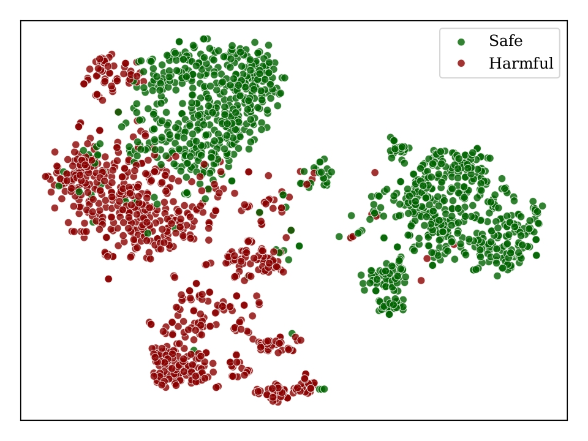
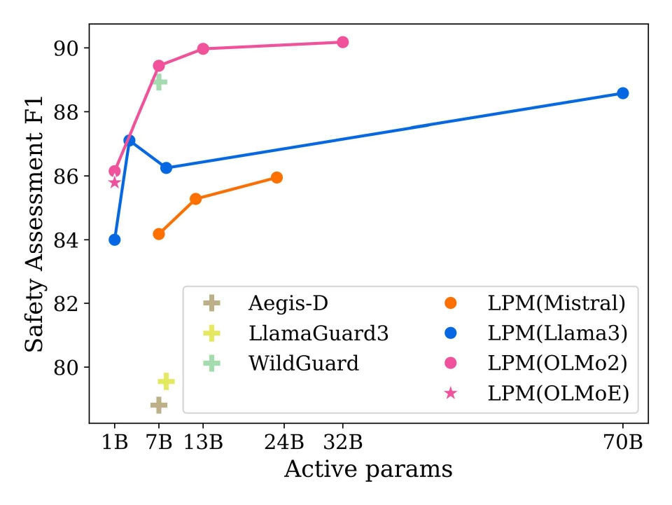

# Latent Prototype Moderator
This is the official repository for the paper "Do LLMs Understand the Safety of Their Inputs? Training-Free Moderation via Latent Prototypes"


<figure>
  
  <figcaption>TSNE visualisation of the safe and harmful samples from WildGuardMix training set in the latent space of OLMo-7B. Harmful and safe samples cluster together, motivating us to assess the prompt safety via latent space distance.</figcaption>
</figure>

<figure>
  
  <figcaption>Average moderation score across 8 diverse datasets. Latent Prototype Moderation~(LPM), our distance-based safety assessment method, outperforms existing guard models on safety assessment while requiring no training and providing customizability.</figcaption>
</figure>


## Abstract
With the rise of LLMs, ensuring model safety and alignment has become a critical concern.
While modern instruction-finetuned LLMs incorporate alignment during training, they still frequently require moderation tools to prevent unsafe behavior. The most common approach to moderation are guard models that flag unsafe inputs. However, guards require costly training and are typically limited to fixed-size, pre-trained options, making them difficult to adapt to evolving risks and resource constraints.
We hypothesize that instruction-finetuned LLMs already encode safety-relevant information internally and explore training-free safety assessment methods that work with off-the-shelf models.
We show that simple prompting allows models to recognize harmful inputs they would otherwise mishandle.
We also demonstrate that safe and unsafe prompts are distinctly separable in the models' latent space.
Building on this, we introduce the Latent Prototype Moderator (LPM), a training-free moderation method that uses Mahalanobis distance in latent space to assess input safety.
LPM is a lightweight, customizable add-on that generalizes across model families and sizes.
Our method matches or exceeds state-of-the-art guard models across multiple safety benchmarks, offering a practical and flexible solution for scalable LLM moderation.

## Table of Contents
- [Abstract](#abstract)
- [Table of Contents](#table-of-contents)
- [Reproducing Results](#reproducing-results)
  - [Pre-requisites](#pre-requisites)
    - [Environment](#environment)
    - [Data](#data)
  - [Evaluating baselines](#evaluating-baselines)
    - [Guard Models](#guard-models)
    - [Prompting Off-the-shelf Models](#prompting-off-the-shelf-models)
  - [Calculating latent representations](#calculating-latent-representations)
    - [Training data](#training-data)
    - [Evaluation data](#evaluation-data)
  - [Evaluating LPM](#evaluating-lpm)
    - [All eval datasets](#all-eval-datasets)
    - [Per categories prototypes](#per-categories-prototypes)
    - [Per dataset prototypes](#per-dataset-prototypes)
    - [Evaluating with different number of samples per class](#evaluating-with-different-number-of-samples-per-class)
  - [Plotting](#plotting)
- [Citation](#citation)
## Reproducing Results
### Pre-requisites
#### Environment
To reproduce the results, you need to install the following packages:
```bash
pip install -r requirements.txt
```

#### Data
To download the data, first run the following commands:
```bash
git clone git@github.com:allenai/safety-eval.git
python scripts/preprocessing/prepare_datasets.py
python scripts/preprocessing/prepare_training_datasets.py.py
python scripts/preprocessing/prepare_wildguard_mix_for_training.py
```


### Evaluating baselines
#### Guard Models
To evaluate the Guard models, run the following command:
```bash
python scripts/evaluation/generate_llm_classifiers_outputs.py \
    --base_model $model \
    --save_folder results/baseline_scores/$save_folder \
    --harmful_benchmarks_folder data/processed_benchmarks/harmfulness/prompt/ \
    --non_harmful_benchmarks_folder data/processed_benchmarks/general_capabilities/ \
    --batch_size 2
```
where `$model` is the name of the model you want to evaluate (e.g., `nvidia/Aegis-AI-Content-Safety-LlamaGuard-Defensive-1.0`, `allenai/wildguard`, etc.) and `$save_folder` is the name of the folder where you want to save the results.
#### Prompting Off-the-shelf Models

To evaluate prompted off-the-shelf models, run the following command:
```bash
python scripts/evaluation/evaluate_base_models.py \
    --base_model $model \
    --use_base_template $use_base_template \
    --save_folder results/baseline_scores/$save_folder \
    --harmful_benchmarks_folder data/processed_benchmarks/harmfulness/prompt/ \
    --non_harmful_benchmarks_folder data/processed_benchmarks/general_capabilities/ \
    --batch_size 1
```
where `$model` is the name of the model you want to evaluate (e.g., `meta-llama/Llama-3.1-8B-Instruct`, `mistralai/Mistral-7B-v0.3`, etc.), `$use_base_template` is a boolean indicating whether to use the base template or not (set it to true when evaluating pre-trained models), and `$save_folder` is the name of the folder where you want to save the results.
### Calculating latent representations

#### Training data
To calculate the latent representations for the training datasets, run the following command:
```bash
python scripts/hidden_states/generate_hidden_states_for_train.py \
    --base_model $model \
    --dataset_path $dataset_path \
    --save_folder datasets/wildguard_hidden_states/$save_folder \
    --add_generation_prompt \
    --batch_size 1
```
where `$model` is the name of the model you want to use (e.g., `meta-llama/Llama-3.1-8B-Instruct`, `mistralai/Mistral-7B-v0.3`, etc.), `$save_folder` is the name of the folder where you want to save the results, and `$dataset_path` is the path to the dataset you want to use (e.g., `datasets/wildguard_mix`).

#### Evaluation data
To calculate the latent representations for the evaluation datasets, run the following command:
```bash
python scripts/hidden_states/generate_eval_hidden_states.py \
    --base_model $model \
    --save_folder datasets/eval_datasets_hidden_states/$save_folder \
    --mmlu_path datasets/processed_benchmarks/general_capabilities/mmlu_r \
    --add_generation_prompt \
    --harmful_benchmarks_folder data/processed_benchmarks/harmfulness/prompt/ \
    --non_harmful_benchmarks_folder data/processed_benchmarks/general_capabilities/ \
    --batch_size 1
```
where `$model` is the name of the model you want to use (e.g., `meta-llama/Llama-3.1-8B-Instruct`, `mistralai/Mistral-7B-v0.3`, etc.), `$save_folder` is the name of the folder where you want to save the results.

### Evaluating LPM
To use the Latent Prototype Moderator (LPM) you need to have the latent representations of the training and evaluation datasets.
#### All eval datasets
To evaluate the LPM on all evaluation datasets, run the following command:
```bash
python scripts/hidden_states/eval_prototype_based_classificaiton.py \
    --train_hidden_states_folder datasets/wildguard_hidden_states/$model \
    --save_folder results/prototypes/$model \
    --harmful_benchmarks_folder datasets/eval_datasets_hidden_states/$model/harmful/ \
    --non_harmful_benchmarks_folder datasets/eval_datasets_hidden_states/$model/general_benchmarks/ \
    --layer_file_name layer_"$layer"_hidden_states.parquet
```
where `$model` is the folder at which the latent representations of the training datasets are saved (e.g., `datasets/wildguard_hidden_states/meta-llama/Llama-3.1-8B-Instruct`), `$layer` is the layer at which the latent representations are saved (e.g., `0`, `1`, `2`, etc.), and `$save_folder` is the name of the folder where you want to save the results.
#### Per categories prototypes
To evaluate the LPM in the incremental setup with the prototypes of the categories, run the following command:
```bash
python scripts/hidden_states/eval_prototype_based_with_categories.py \
    --train_hidden_states_folder datasets/wildguard_hidden_states/$model \
    --save_folder results/prototypes_per_ordered_categories/$model \
    --harmful_benchmarks_folder datasets/eval_datasets_hidden_states/$model/harmful/ \
    --non_harmful_benchmarks_folder datasets/eval_datasets_hidden_states/$model/general_benchmarks/ \
    --layer_file_name layer_"$layer"_hidden_states.parquet
```
where `$model` is the folder at which the latent representations of the training datasets are saved (e.g., `datasets/wildguard_hidden_states/meta-llama/Llama-3.1-8B-Instruct`), `$layer` is the layer at which the latent representations are saved (e.g., `0`, `1`, `2`, etc.), and `$save_folder` is the name of the folder where you want to save the results.

#### Per dataset prototypes
To evaluate the LPM in the incremental setup with the prototypes from different datasets, run the following command:
```bash
python scripts/hidden_states/prototype_based_classificaiton_multiple_datasets.py \
        --wild_guard_hidden_states_folder datasets/wildguard_hidden_states/$model \
        --aegis_hidden_states_folder datasets/prototypes_training_dataset/aegis_hidden_states/$model \
        --toxichat_hidden_states_folder datasets/prototypes_training_dataset/toxichat_hidden_states/$model \
        --save_folder results/prototypes_multidatasets_added_means/$model \
        --harmful_benchmarks_folder datasets/eval_datasets_hidden_states/$model/harmful/ \
        --non_harmful_benchmarks_folder datasets/eval_datasets_hidden_states/$model/general_benchmarks/ \
        --layer_file_name layer_"$layer"_hidden_states.parquet \
```
where `$model` is the folder at which the latent representations of the training datasets are saved (e.g., `datasets/wildguard_hidden_states/meta-llama/Llama-3.1-8B-Instruct`), `$layer` is the layer at which the latent representations are saved (e.g., `0`, `1`, `2`, etc.), and `$save_folder` is the name of the folder where you want to save the results.

#### Evaluating with different number of samples per class
To evaluate the LPM with different number of samples per class, run the following command:
```bash
python scripts/hidden_states/eval_prototype_based_classificaiton.py \
    --train_hidden_states_folder datasets/wildguard_hidden_states/$model \
    --save_folder results/prototypes_different_num_samples_seeds/$model/seed_$seed_id/"$num_samples"_samples \
    --harmful_benchmarks_folder datasets/eval_datasets_hidden_states/$model/harmful/ \
    --non_harmful_benchmarks_folder datasets/eval_datasets_hidden_states/$model/general_benchmarks/ \
    --layer_file_name layer_32_hidden_states.parquet \
    --num_samples_per_class $num_samples
```
where `$model` is the folder at which the latent representations of the training datasets are saved (e.g., `datasets/wildguard_hidden_states/meta-llama/Llama-3.1-8B-Instruct`), `$layer` is the layer at which the latent representations are saved (e.g., `0`, `1`, `2`, etc.), `$save_folder` is the name of the folder where you want to save the results, and `$num_samples` is the number of samples per class you want to use (e.g., `10`, `100`, `1000`, etc.).
### Plotting
All plots are generated by scripts in the `scripts/plotting` folder, additionaly all data used for plotting is available in `plotting/data` folder.

## Citation
If you use this code in your research, please cite our paper:
```bibtex
@misc{chrabąszcz2025maybeianswerthat,
      title={Do LLMs Understand the Safety of Their Inputs? Training-Free Moderation via Latent Prototypes},
      author={Maciej Chrabąszcz and Filip Szatkowski and Bartosz Wójcik and Jan Dubiński and Tomasz Trzciński and Sebastian Cygert},
      year={2025},
      eprint={2502.16174},
      archivePrefix={arXiv},
      primaryClass={cs.LG},
      url={https://arxiv.org/abs/2502.16174},
}
```